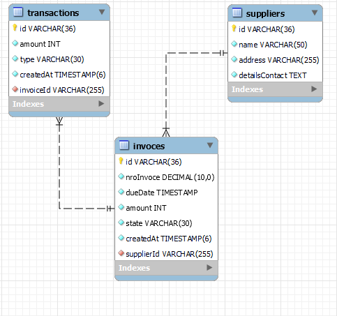

# Payana Challengue

Desafío Técnico Backend para [Payana](https://payana.la/)

Para probar la api directamente se pueden seguir los pasos para produccion, levantando los contenedores (es necesario contar con docker compose)

## Tecnologia

Stack utilizado

```
Nodejs
NestJS
MySQL
```

## Herramientas para desarrollo

- Necesarios

```
NodeJS v18 o superior
Nest Cli v10.0.2
Docker-compose v4.20 o superior
```

- Opcionales

```
Postman o cliente http de preferencia
MySQL client de preferencia
```

## Pasos para desarrollo

```
1. Clonar proyecto
2. npm i
3. docker-compose up
4. npm run start:dev
```

## Pasos para produccion

```
1. Clonar proyecto
2. docker-compose -f docker-compose.prod.yml --env-file .env.prod up --build
```

## Documentacion de los endpoints

```
http://localhost:3000/swagger#/
```

## Diagrama de base de datos


